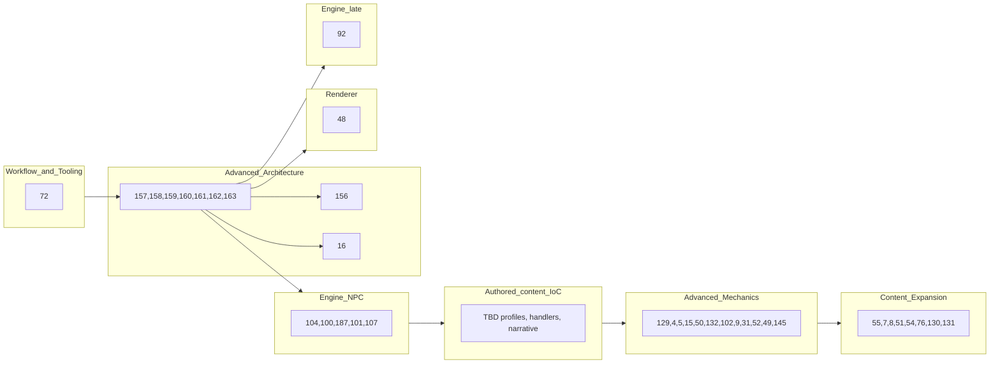

# DOSMUD ANSI C89 Development Plan

### Core Project Rules

The project should treat these as non-negotiable:

```text
Language target:
- ANSI C89 / ISO C90
- OpenWatcom compatible
- GCC compatible
- No compiler extensions required
```

The project should prioritize:

- deterministic gameplay
- procedural ANSI C architecture
- explicit ownership and state flow
- DOS/OpenWatcom portability
- maintainability over rapid expansion
- subsystem isolation
- deterministic testing

The project should avoid:

- framework-style architecture
- object-emulation patterns
- ECS-style abstractions
- hidden ownership
- platform/render leakage into gameplay
- premature complexity

When a draft **implementation** PR is opened for an issue that **already has a section** here, mark that section **Done ✅** under its heading (optional PR link in the body). Do not mark Done at issue-create time or on hygiene/docs-only PRs. That line is not updated on later pushes or after merge - use the GitHub project board and PR for workflow status.

**Agents:** search for the issue (`#N` or section heading) before editing. For a new milestone-tracked issue whose milestone is **already represented** in this file: add the table row and `### [#N](...)` stub via [milestone-issue-hygiene](.cursor/skills/milestone-issue-hygiene/SKILL.md) in a **docs PR** (GitHub-only hygiene in plan mode; no `DEV_PLAN.md` commits until a branch is allowed). Mark **Done ✅** only when a draft **implementation** PR opens. Do not add sections for BAU issues without a Milestone, or for Milestones not tracked here. See [`AGENTS.md`](AGENTS.md) **DEV_PLAN updates**. To reconcile this file with GitHub, use [audit-github-devplan](.cursor/skills/audit-github-devplan/SKILL.md).

**Milestones:** [Structural Cleanup + ANSI C89 Enforcement](https://github.com/ianmays/dosmud/milestone/1) · [State Ownership and Boundary Isolation](https://github.com/ianmays/dosmud/milestone/2) · [Deterministic Test Harness Evolution](https://github.com/ianmays/dosmud/milestone/3) · [Workflow and Tooling Maturity](https://github.com/ianmays/dosmud/milestone/4) · [Advanced Architecture](https://github.com/ianmays/dosmud/milestone/5) · [Content Expansion](https://github.com/ianmays/dosmud/milestone/6) · [Renderer](https://github.com/ianmays/dosmud/milestone/7) · [Advanced Mechanics](https://github.com/ianmays/dosmud/milestone/8) · [Engine Enhancements](https://github.com/ianmays/dosmud/milestone/9) · **Authored content and engine IoC (proposed milestone 10)**

### Execution order (open work)

Milestone numbers are **themes**, not strict schedule. Suggested pull order for open issues (see GitHub **blocked-by** relationships on each issue):



**Completed (m5):** [#71](https://github.com/ianmays/dosmud/issues/71) engine boundary, [#47](https://github.com/ianmays/dosmud/issues/47) event queue ([#164](https://github.com/ianmays/dosmud/pull/164)), [#157](https://github.com/ianmays/dosmud/issues/157) command/navigation GameEvent migration ([#167](https://github.com/ianmays/dosmud/pull/167)), [#158](https://github.com/ianmays/dosmud/issues/158) inventory/item GameEvent migration ([#173](https://github.com/ianmays/dosmud/pull/173)), [#159](https://github.com/ianmays/dosmud/issues/159) combat/progression GameEvent migration ([#174](https://github.com/ianmays/dosmud/pull/174)), [#160](https://github.com/ianmays/dosmud/issues/160) dialogue/encounter GameEvent migration ([#175](https://github.com/ianmays/dosmud/pull/175)), [#161](https://github.com/ianmays/dosmud/issues/161) ambient/inspect GameEvent migration ([#176](https://github.com/ianmays/dosmud/pull/176)), [#162](https://github.com/ianmays/dosmud/issues/162) legacy GAME_OUT removal ([#177](https://github.com/ianmays/dosmud/pull/177)), [#163](https://github.com/ianmays/dosmud/issues/163) GameEvent test coverage pass ([#181](https://github.com/ianmays/dosmud/pull/181)), adjacent [#156](https://github.com/ianmays/dosmud/issues/156) replay event log ([#183](https://github.com/ianmays/dosmud/pull/183)), and [#16](https://github.com/ianmays/dosmud/issues/16) save/load ([#184](https://github.com/ianmays/dosmud/pull/184)). **m5 GameEvent migration chain complete.**

**Active pull order:** [#107](https://github.com/ianmays/dosmud/issues/107) roaming bandit encounter ([#192](https://github.com/ianmays/dosmud/pull/192); closes m9 NPC chain after [#101](https://github.com/ianmays/dosmud/issues/101) ([#189](https://github.com/ianmays/dosmud/pull/189)), [#104](https://github.com/ianmays/dosmud/issues/104), [#100](https://github.com/ianmays/dosmud/issues/100), [#187](https://github.com/ianmays/dosmud/issues/187)). Next platform gate: [Authored content and engine IoC](#authored-content-and-engine-ioc-proposed-milestone-10) (proposed m10; stub issues #TBD-1 through #TBD-4 after #107 lands).

Workflow (milestone 4) can run in parallel with architecture once unblocked. Milestone 5 **GameEvent migration** (#157 through #163) and adjacent [#156](https://github.com/ianmays/dosmud/issues/156) / [#16](https://github.com/ianmays/dosmud/issues/16) are **complete**. Content (6) and renderer (7) are not gated on all of mechanics (8).

**Dependencies:** native GitHub **blocked-by** links on issues (Relationships sidebar). [#71](https://github.com/ianmays/dosmud/issues/71) and [#47](https://github.com/ianmays/dosmud/issues/47) are **closed**; downstream issues may still list them as blockers in GitHub Relationships. Key chains: [#71](https://github.com/ianmays/dosmud/issues/71) before [#47](https://github.com/ianmays/dosmud/issues/47) / [#104](https://github.com/ianmays/dosmud/issues/104); [#47](https://github.com/ianmays/dosmud/issues/47) before [#157](https://github.com/ianmays/dosmud/issues/157), [#158](https://github.com/ianmays/dosmud/issues/158), [#159](https://github.com/ianmays/dosmud/issues/159), [#160](https://github.com/ianmays/dosmud/issues/160), [#161](https://github.com/ianmays/dosmud/issues/161), [#162](https://github.com/ianmays/dosmud/issues/162), [#163](https://github.com/ianmays/dosmud/issues/163), and separate lane [#156](https://github.com/ianmays/dosmud/issues/156); direct migration chain order: [#157](https://github.com/ianmays/dosmud/issues/157) before [#158](https://github.com/ianmays/dosmud/issues/158) before [#159](https://github.com/ianmays/dosmud/issues/159) before [#160](https://github.com/ianmays/dosmud/issues/160) before [#161](https://github.com/ianmays/dosmud/issues/161) before [#162](https://github.com/ianmays/dosmud/issues/162) before [#163](https://github.com/ianmays/dosmud/issues/163); [#71](https://github.com/ianmays/dosmud/issues/71) and [#47](https://github.com/ianmays/dosmud/issues/47) before [#48](https://github.com/ianmays/dosmud/issues/48); [#104](https://github.com/ianmays/dosmud/issues/104) before [#100](https://github.com/ianmays/dosmud/issues/100); [#100](https://github.com/ianmays/dosmud/issues/100) before [#187](https://github.com/ianmays/dosmud/issues/187); [#187](https://github.com/ianmays/dosmud/issues/187) before [#101](https://github.com/ianmays/dosmud/issues/101) / [#102](https://github.com/ianmays/dosmud/issues/102) / [#107](https://github.com/ianmays/dosmud/issues/107); proposed m10 chain after m9 NPC work: [#107](https://github.com/ianmays/dosmud/issues/107) before #TBD-1 (placement profile; first slice in [#192](https://github.com/ianmays/dosmud/pull/192)) before #TBD-2 (encounter handlers) and #TBD-3 (narrative indirection); #TBD-1 before m8 [#52](https://github.com/ianmays/dosmud/issues/52) and m6 [#54](https://github.com/ianmays/dosmud/issues/54), [#76](https://github.com/ianmays/dosmud/issues/76), and [#8](https://github.com/ianmays/dosmud/issues/8) (see [m10 stub table](#authored-content-and-engine-ioc-proposed-milestone-10)); [#104](https://github.com/ianmays/dosmud/issues/104) before [#8](https://github.com/ianmays/dosmud/issues/8); [#4](https://github.com/ianmays/dosmud/issues/4) and [#5](https://github.com/ianmays/dosmud/issues/5) are **not** blocked by [#15](https://github.com/ianmays/dosmud/issues/15) (combat slices ship first; [#15](https://github.com/ianmays/dosmud/issues/15) may enhance formulas later); [#50](https://github.com/ianmays/dosmud/issues/50) before [#132](https://github.com/ianmays/dosmud/issues/132); [#52](https://github.com/ianmays/dosmud/issues/52) before [#49](https://github.com/ianmays/dosmud/issues/49); [#142](https://github.com/ianmays/dosmud/issues/142) (fmt render migration) before [#145](https://github.com/ianmays/dosmud/issues/145) (local map viewport); [#92](https://github.com/ianmays/dosmud/issues/92) after [#16](https://github.com/ianmays/dosmud/issues/16), [#71](https://github.com/ianmays/dosmud/issues/71), [#47](https://github.com/ianmays/dosmud/issues/47).

### Relative size (GitHub project)

**Size** (XS–XL on [project 1](https://github.com/users/ianmays/projects/1)) is relative effort / blast radius, not schedule. It is independent of **Priority** (P0/P1/P2) and column **stack order** (execution order above). Board **Status** may differ from pull order (e.g. [#100](https://github.com/ianmays/dosmud/issues/100) Agent-ready while [#48](https://github.com/ianmays/dosmud/issues/48) stays in Backlog).

| Size | Meaning | Examples (open roadmap) |
|------|---------|-------------------------|
| XS | single trivial change | *(none currently)* |
| S | narrow feature or tooling slice | #4 |
| M | one subsystem feature or refactor | #5, #7, #9, #31, #49, #51, #54, #100, #101, #102, #129, #130, #131, #132, #145, #187 |
| L | major mechanism or platform path | #8, #15, #50, #52, #107 |
| XL | foundational or multi-area epic | #48, #55, #76, #92 |

[#71](https://github.com/ianmays/dosmud/issues/71) **XL** and [#47](https://github.com/ianmays/dosmud/issues/47) **L** established the engine boundary and event-queue seam ([#164](https://github.com/ianmays/dosmud/pull/164)). [#104](https://github.com/ianmays/dosmud/issues/104) npc module landed ([#185](https://github.com/ianmays/dosmud/pull/185)). Remaining gates: [#48](https://github.com/ianmays/dosmud/issues/48) and [#92](https://github.com/ianmays/dosmud/issues/92) still build on that work.

### Current Project Priority

The project is currently in an architectural consolidation phase.

Highest-value work:

1. clarify subsystem ownership
2. reduce architecture drift
3. improve deterministic testing
4. preserve ANSI C89 portability
5. improve workflow/tooling discipline

Large-scale gameplay/content expansion should remain secondary until the core architecture stabilizes.

### Hard Constraints

#### Allowed
- fixed arrays
- static/global storage
- procedural architecture
- explicit state passing
- simple structs
- deterministic systems

#### Avoid
- dynamic allocation
- recursion
- compiler-specific features
- C99/C11 features
- hidden globals
- giant monolithic modules

## [Structural Cleanup + ANSI C89 Enforcement](https://github.com/ianmays/dosmud/milestone/1)

#### Primary Goals

- reduce complexity concentration
- preserve portability
- clarify subsystem ownership

### [#42](https://github.com/ianmays/dosmud/issues/42) - Split `game.c`

Done ✅ ([#88](https://github.com/ianmays/dosmud/pull/88)).

Highest-priority architecture task.

Orchestration stays in `game.c`; combat, dialogue (pond + NPC hint), atmosphere (`gatmos`), wanderer, progression (`gprog`), and ambient encounter entry (`genc`) live in dedicated translation units (see `docs/architecture.md`).

Target structure:

```text
src/
    game.c
    combat.c
    dialogue.c
    gatmos.c
    wanderer.c
    gprog.c
    genc.c
```

#### `game.c`
Only:
- high-level orchestration
- tick sequencing
- command routing
- mode transitions

#### `combat.c`
Own:
- combat state
- combat flow
- enemy turns
- combat rewards

#### `dialogue.c`
Own:
- NPC dialogue
- reply handling
- dialogue state

#### `wanderer.c`
Own:
- wanderer movement
- encounter triggering
- separation logic

#### `gatmos.c` (atmosphere)
Own:
- ambient effects
- inspect clues
- environmental state

#### `gprog.c` (progression)
Own:
- XP
- leveling
- scaling

#### `genc.c` (encounter)
Own:
- random encounter spawning
- bandit logic
- encounter sequencing

Goal:
- reduce coupling
- simplify debugging
- improve maintainability
- prepare for renderer/platform separation

### ANSI C89 cleanup and compiler enforcement

#### Remove all K&R function definitions

✅ Done - no K&R definitions remain in `src/`.

#### Enforce strict C89 compilation

✅ Done - flags live in the `Makefile`.

GCC:

```text
-std=c89
-pedantic
-Wall
-Wextra
-Wshadow
-Wstrict-prototypes
-Wmissing-prototypes
```

Tests/CI only:

```text
-Werror
```

Compiler discipline and warning cleanliness should remain early priorities throughout development.

#### Ensure OpenWatcom parity

✅ Done - `make dos-prepare` covers the OpenWatcom path; ongoing discipline.

#### Remove mixed declarations/statements

✅ Done - enforced by `-pedantic`.

#### Replace C99 comments

✅ Done - no `//` comments remain in `src/`.

#### Centralize gameplay tuning values

✅ Done - gameplay tuning values live in `include/config.h`.

### [#41](https://github.com/ianmays/dosmud/issues/41) - Compatibility typedefs

✅ Done - [`include/base.h`](include/base.h) defines `u8`/`u16`/`u32` with documented width assumptions and compile-time `sizeof` guards; tick and byte-flag fields in `game.h` / `world.h` use these types.

## [State Ownership and Boundary Isolation](https://github.com/ianmays/dosmud/milestone/2)

### [#43](https://github.com/ianmays/dosmud/issues/43) - State machine for game modes

Done ✅ ([#99](https://github.com/ianmays/dosmud/pull/99)).

[`src/game.h`](src/game.h) defines `GameMode` (`GAME_MODE_EXPLORE`, `GAME_MODE_DIALOGUE`, `GAME_MODE_COMBAT`), `DialogueKind` (room NPCs including frog, traveler, enemy), and `CombatState` (`enemy_hp`, `defending`). `GameState` holds `mode`, `dialogue`, and `combat` instead of overlapping `pond_dialogue`, `traveler_dialogue`, `enemy_dialogue`, `npc_dialogue`, and `combat_active` flags. Transitions go through `game_set_mode_explore`, `game_set_mode_dialogue`, and `game_set_mode_combat` in [`src/game.c`](src/game.c).

### [#44](https://github.com/ianmays/dosmud/issues/44) - Formalize engine boundaries

Done ✅ ([#103](https://github.com/ianmays/dosmud/pull/103)).

- Documented core / render / platform layers in `docs/architecture.md`
- Moved all `invent.c` player output to `render_inv_*` in `grendr`
- Added `make check-layers` to reject `printf` outside `main.c`, `grendr.c`, and the platform file (`platpos.c` / `platdos.c`) (run explicitly or via `make test-all`; not part of `make test`)

### [#45](https://github.com/ianmays/dosmud/issues/45) - Platform layer

Done ✅ ([#106](https://github.com/ianmays/dosmud/pull/106)).

- [`include/platform.h`](include/platform.h) - `plat_poll_line`, `plat_time_now`, `plat_seed_rng`
- [`src/platdos.c`](src/platdos.c) / [`src/platpos.c`](src/platpos.c) - DOS vs POSIX implementations (FAT 8.3 names; flat `src/` layout)
- [`src/main.c`](src/main.c) - no `#ifdef __WATCOMC__`; orchestration only

## [Deterministic Test Harness Evolution](https://github.com/ianmays/dosmud/milestone/3)

#### Existing snapshot testing

Pattern (under `tests/regression/`):

```text
<name>.input
<name>.expect
```

Run:

```text
make test && make test-run
```

Or manually: `./dosmud < tests/regression/<name>.input > tests/regression/<name>.output` then `diff` against `.expect`.

### [#66](https://github.com/ianmays/dosmud/issues/66) / [#112](https://github.com/ianmays/dosmud/issues/112) - Improve deterministic test setup

Done ✅ ([#110](https://github.com/ianmays/dosmud/pull/110), [#120](https://github.com/ianmays/dosmud/pull/120)).

`TEST_MODE` builds link [`tests/harness/testharn.c`](tests/harness/testharn.c) and [`tests/harness/th_world.c`](tests/harness/th_world.c). Snapshot `.input` files use `@fixture <name>` for known state without RNG-walking setup. Canonical fixture and test lists: [`docs/testing.md`](docs/testing.md). [#66](https://github.com/ianmays/dosmud/issues/66) added the harness; [#112](https://github.com/ianmays/dosmud/issues/112) migrated brittle snapshots to fixtures and roll inject for `equipment`.

Follow-up (under [#40](https://github.com/ianmays/dosmud/issues/40) umbrella):

- **[#66](https://github.com/ianmays/dosmud/issues/66)** Done ✅ ([#110](https://github.com/ianmays/dosmud/pull/110)) - `TEST_MODE` harness and fixture DSL (see combined section with [#112](https://github.com/ianmays/dosmud/issues/112) above)
- **[#112](https://github.com/ianmays/dosmud/issues/112)** Done ✅ ([#120](https://github.com/ianmays/dosmud/pull/120)) - migrated `equipment`, `area_items`, `craft_wielded`, `map`, `smoke` to fixtures; `seed_cli` still uses CLI `--seed` on `smoke.input`.
- **[#115](https://github.com/ianmays/dosmud/issues/115)** Done ✅ ([#123](https://github.com/ianmays/dosmud/pull/123)) - snapshot coverage; details in the section below.
- **[#122](https://github.com/ianmays/dosmud/issues/122)** Done ✅ ([#124](https://github.com/ianmays/dosmud/pull/124)) - optional `@seed <unsigned>` line in snapshot `.input` files.
- **[#95](https://github.com/ianmays/dosmud/issues/95)** Done ✅ ([#127](https://github.com/ianmays/dosmud/pull/127)) - unit tests; **~96%** weighted branch coverage on core modules
- **[#116](https://github.com/ianmays/dosmud/issues/116)** Done ✅ ([#133](https://github.com/ianmays/dosmud/pull/133)) - soak / stress harness (`make test-soak`, CI benchmarks)
- **[#113](https://github.com/ianmays/dosmud/issues/113)** Done ✅ ([#125](https://github.com/ianmays/dosmud/pull/125)) - traveler snapshot fixtures (`traveler_dialogue` fixture; `traveler_replies`, `traveler_talk_blocked` snapshots)
- **[#114](https://github.com/ianmays/dosmud/issues/114)** Done ✅ ([#126](https://github.com/ianmays/dosmud/pull/126)) - custom world boot fixture (`world_boot` / `world_linear`; `world_apply_graph` + harness tables in TEST_MODE)

### [#40](https://github.com/ianmays/dosmud/issues/40) - Gameplay test coverage (umbrella epic) — Done ✅

**[#40](https://github.com/ianmays/dosmud/issues/40)** tracked overall coverage; work landed via child issues (no mega-PR on [#40](https://github.com/ianmays/dosmud/issues/40)). **Epic complete** as of merge of [#116](https://github.com/ianmays/dosmud/issues/116) ([PR 133](https://github.com/ianmays/dosmud/pull/133)).

| Issue | Role |
|-------|------|
| [#40](https://github.com/ianmays/dosmud/issues/40) | Done ✅: umbrella epic (child issues below) |
| [#66](https://github.com/ianmays/dosmud/issues/66) | Done ✅: `TEST_MODE` harness + fixture DSL |
| [#46](https://github.com/ianmays/dosmud/issues/46) | Done ✅: runtime `--seed` CLI |
| [#112](https://github.com/ianmays/dosmud/issues/112) | Done ✅: migrate 5 brittle snapshots to fixtures |
| [#113](https://github.com/ianmays/dosmud/issues/113) | Done ✅: wanderer snapshot fixtures |
| [#114](https://github.com/ianmays/dosmud/issues/114) | Done ✅: custom world boot fixture |
| [#115](https://github.com/ianmays/dosmud/issues/115) | Done ✅: snapshot coverage + RNG hardening ([`docs/testing.md`](docs/testing.md)) |
| [#122](https://github.com/ianmays/dosmud/issues/122) | Done ✅: optional `@seed` harness directive for `.input` files |
| [#95](https://github.com/ianmays/dosmud/issues/95) | Done ✅: unit tests ([PR 127](https://github.com/ianmays/dosmud/pull/127)); **96%+** branch coverage on core modules |
| [#116](https://github.com/ianmays/dosmud/issues/116) | Done ✅: soak / stress (`make test-soak`, [PR 133](https://github.com/ianmays/dosmud/pull/133)) |

**Three layers (see [`docs/testing.md`](docs/testing.md)):** snapshots (`make test-run`), unit tests (`make test-unit`), soak/stress (`make test-soak`). `make test-all` runs check-layers, snapshots, unit coverage, and soak.

**Snapshot coverage ([#115](https://github.com/ianmays/dosmud/issues/115)) delivered:** 59 snapshots in `SNAPSHOT_TESTS` at delivery plus `seed_cli` (60 total in `make test-run`); suite now 75 in `SNAPSHOT_TESTS` plus `seed_cli` (76 total). Combat defend/salve/victory/loot/level-up, all room NPC talk branches, eat/use/inspect variants, `quiet_explore` for wait/move/map, bandit fight/intimidate/bag-empty/fixed-road, loot tiers, meta commands. RNG: `game_roll_percent` for intimidate; `test_quiet_ticks`; `CFG_TEST_*` inject constants.

**Harness layout (final):** fixture DSL and `@seed` in [`tests/harness/testharn.c`](tests/harness/testharn.c); seed-1234 world graph in [`tests/harness/th_world.c`](tests/harness/th_world.c) (shared by snapshots, unit, soak).

### [#115](https://github.com/ianmays/dosmud/issues/115) - Snapshot coverage (Done ✅)

Delivered in [PR 123](https://github.com/ianmays/dosmud/pull/123).

**Gameplay / harness**

- Bandit intimidate uses `game_roll_percent` (injectable in `TEST_MODE`).
- `GameState.test_quiet_ticks` + `quiet_explore` fixture: tick-advancing tests skip atmosphere, animal noise, bandit ambush, and wanderer movement.
- Extended [`tests/harness/testharn.c`](tests/harness/testharn.c): room fixtures, bag helpers, env focus, combat-ready/victory inject, intimidate/fight ready fixtures.

**Tests**

- `Makefile` `SNAPSHOT_TESTS` (includes `smoke`); `seed_cli` alone uses `--seed 1234` on `smoke.input`.
- New regression pairs under `tests/regression/` for movement, NPCs, combat, loot, eat/use, inspect, bandit dialogue paths, and edge cases.

**Docs**

- [`docs/testing.md`](docs/testing.md) - fixture tables, determinism model, snapshot file list, adding-a-snapshot checklist.
- [`docs/architecture.md`](docs/architecture.md) - harness and RNG split updated.

**Unit scope:** `command`, `invent`, `combat`, `game`, `genc`, `wanderer`, `dialogue`, `gatmos`, `world` (fixed graph), `gprog`, `items`, `fmt`, `gout`, `replay`, `testharn`. Out of scope: `grendr`, `txtres`, `main`, platform glue.

### [#95](https://github.com/ianmays/dosmud/issues/95) - Unit tests (Done ✅)

Delivered in [PR 127](https://github.com/ianmays/dosmud/pull/127).

**Framework**

- [greatest 1.5.0](https://github.com/silentbicycle/greatest/releases/tag/v1.5.0) vendored as [`tests/unit/greatest.h`](tests/unit/greatest.h) (upstream commit + dosmud quiet-output patch in a follow-up commit).
- `make test-unit`, verbose/coverage targets; 88 unit tests; CI via [`scripts/ci-test-report.sh`](scripts/ci-test-report.sh) with PR result comment.

**Coverage**

- Weighted **95.7%** branch / **82.7%** line on in-scope modules (`make test-unit-coverage`).
- `render_set_suppress` in `TEST_MODE` keeps default runs quiet; `--verbose-gameplay` restores render text.

**Layout / tooling**

- Snapshots under [`tests/regression/`](tests/regression/).
- `dos-prepare.ps1` copies only `src/`, `include/`, `build.bat`.
- Harness `bag_full_gate` fixture for `testharn_apply` `-2` paths.

**Docs**

- [`docs/testing.md`](docs/testing.md) - unit layout, coverage levels, CI PR comment, shared `th_world.c` graph.

### [#116](https://github.com/ianmays/dosmud/issues/116) - Soak / stress tests (Done ✅)

Delivered in [PR 133](https://github.com/ianmays/dosmud/pull/133).

**Harness**

- Separate binary `tests/soak/build/dosmud_soak` via `make test-soak` (not linked into `make test-unit`).
- Long fixed-seed loops with `soak_assert_game_state_ok`; combat uses `CFG_TEST_SOAK_COMBAT_CHECK_INTERVAL` (50) over 200 rounds.

**Benchmarks**

- `SOAK_BENCH` lines with `us_per_tick` and `limit=` from `CFG_TEST_SOAK_LIMIT_*` in `config.h`.
- [`scripts/ci-test-report.sh`](scripts/ci-test-report.sh) soak step + PR benchmark table (parsed from log).

**Related cleanup in [PR 133](https://github.com/ianmays/dosmud/pull/133)**

- `testharn` moved from `src/` to `tests/harness/`; `dos-prepare.ps1` copies `tests/harness` for DOS `TEST_MODE`.

### [#46](https://github.com/ianmays/dosmud/issues/46) - Runtime `--seed`

Done ✅ ([#109](https://github.com/ianmays/dosmud/pull/109)).

```text
dosmud --seed 1234
```

## [Workflow and Tooling Maturity](https://github.com/ianmays/dosmud/milestone/4)

| Issue | Title | Size |
|-------|-------|------|
| [#74](https://github.com/ianmays/dosmud/issues/74) | agent skills | M |
| [#82](https://github.com/ianmays/dosmud/issues/82) | compile performance | S |
| [#150](https://github.com/ianmays/dosmud/issues/150) | CI stats reporting | S |
| [#34](https://github.com/ianmays/dosmud/issues/34) | modern windows build | L |
| [#72](https://github.com/ianmays/dosmud/issues/72) | sub-agents | S |

### [#74](https://github.com/ianmays/dosmud/issues/74) - Agent skills

Done ✅ ([#165](https://github.com/ianmays/dosmud/pull/165), [#166](https://github.com/ianmays/dosmud/pull/166)).

Capture:
- workflow knowledge
- repo conventions
- deterministic testing workflows
- DOS/OpenWatcom constraints
- architecture expectations

### [#34](https://github.com/ianmays/dosmud/issues/34) - Modern Windows build

Done ✅ ([#153](https://github.com/ianmays/dosmud/pull/153)).

WSL cross-compile path emits a native Windows console `dosmud.exe` via `make build-win` / `make test-win`, keeping gameplay unchanged and leaving the DOS/Open Watcom path separate.

### [#72](https://github.com/ianmays/dosmud/issues/72) - Sub-agents

Done ✅ ([#166](https://github.com/ianmays/dosmud/pull/166)).

### [#82](https://github.com/ianmays/dosmud/issues/82) - Compile performance

Done ✅ ([#149](https://github.com/ianmays/dosmud/pull/149)).

### [#150](https://github.com/ianmays/dosmud/issues/150) - CI stats reporting

Lightweight CI timings/stats workflow: `scripts/ci-stats.sh` (or equivalent) emits `ci-stats.json` and `ci-stats.md`, publishes Markdown to the GitHub Actions job summary, and uploads both as workflow artifacts.

Done ✅ ([#151](https://github.com/ianmays/dosmud/pull/151)).

## [Advanced Architecture](https://github.com/ianmays/dosmud/milestone/5)

| Issue | Title | Size |
|-------|-------|------|
| [#71](https://github.com/ianmays/dosmud/issues/71) | separate core game engine from game logic | XL |
| [#47](https://github.com/ianmays/dosmud/issues/47) | event queue architecture | L |
| [#157](https://github.com/ianmays/dosmud/issues/157) | migrate remaining command and navigation output to generic GameEvent families | M |
| [#158](https://github.com/ianmays/dosmud/issues/158) | migrate inventory and item interaction flows to generic GameEvent families | L |
| [#159](https://github.com/ianmays/dosmud/issues/159) | migrate combat and progression output to generic GameEvent families | L |
| [#160](https://github.com/ianmays/dosmud/issues/160) | migrate dialogue and encounter output to generic GameEvent families | L |
| [#161](https://github.com/ianmays/dosmud/issues/161) | migrate ambient and inspect output to generic GameEvent families | M |
| [#162](https://github.com/ianmays/dosmud/issues/162) | remove legacy GAME_OUT compatibility and finalize GameEvent API | M |
| [#163](https://github.com/ianmays/dosmud/issues/163) | expand harness and tests for generic GameEvent semantics | M |
| [#156](https://github.com/ianmays/dosmud/issues/156) | deterministic replay event log capability (adjacent track) | L |
| [#16](https://github.com/ianmays/dosmud/issues/16) | save / load | L |

Rows [#71](https://github.com/ianmays/dosmud/issues/71) and [#47](https://github.com/ianmays/dosmud/issues/47) are complete (historical index).

### [#71](https://github.com/ianmays/dosmud/issues/71) - Separate core game engine from game logic

Separate deterministic gameplay/simulation from rendering, platform, and front-end so the engine can support alternative interfaces or games. Unblocked [#47](https://github.com/ianmays/dosmud/issues/47) (done); still relevant for [#104](https://github.com/ianmays/dosmud/issues/104), [#48](https://github.com/ianmays/dosmud/issues/48), and [#92](https://github.com/ianmays/dosmud/issues/92).

Done ✅ ([#155](https://github.com/ianmays/dosmud/pull/155)).

### [#47](https://github.com/ianmays/dosmud/issues/47) - Event queue architecture

Foundation landed in [#164](https://github.com/ianmays/dosmud/pull/164): `GameEvent` / `GameEventQueue` on `gout`, per-step drain via `game_render_output` in `grendr`. Migration slices [#157](https://github.com/ianmays/dosmud/issues/157)-[#161](https://github.com/ianmays/dosmud/issues/161) moved producers to generic `GameEventKind` payloads; [#162](https://github.com/ianmays/dosmud/issues/162) / [#177](https://github.com/ianmays/dosmud/pull/177) removed transitional `GAME_EVENT_LEGACY` and `GAME_OUT_*` compatibility. Seam ownership: [`docs/architecture.md`](docs/architecture.md) Engine and Render sections.

Direct follow-up migration chain (separate from replay/logging):
- [#157](https://github.com/ianmays/dosmud/issues/157)
- [#158](https://github.com/ianmays/dosmud/issues/158)
- [#159](https://github.com/ianmays/dosmud/issues/159)
- [#160](https://github.com/ianmays/dosmud/issues/160)
- [#161](https://github.com/ianmays/dosmud/issues/161)
- [#162](https://github.com/ianmays/dosmud/issues/162)
- [#163](https://github.com/ianmays/dosmud/issues/163)

Adjacent but separate follow-up track:
- [#156](https://github.com/ianmays/dosmud/issues/156) (replay/event log capability)

Done ✅ ([#164](https://github.com/ianmays/dosmud/pull/164)).

### [#157](https://github.com/ianmays/dosmud/issues/157) - Command/navigation GameEvent migration

Direct `#47` follow-up. Migrate remaining command/navigation output to generic event families while keeping visible output stable.

Done ✅ ([#167](https://github.com/ianmays/dosmud/pull/167)).

### Testing
- Unit: `unit_game.c` asserts `GAME_EVENT_*` for help, map, wait, cannot move, and unknown command; `unit_gout.c` covers `game_event_push` for command/nav kinds ([#167](https://github.com/ianmays/dosmud/pull/167))
- Snapshots: `wait_tick` adds `map`; `unknown_cmd`, `cannot_move`, `walk_north`, and `walk_map` stable through `grendr`

### [#158](https://github.com/ianmays/dosmud/issues/158) - Inventory/item GameEvent migration

Direct `#47` follow-up. Move inventory and item-interaction output to generic item/bag/crafting/equipment event families.

Done ✅ ([#173](https://github.com/ianmays/dosmud/pull/173)).

### Testing
- Unit: `unit_inv.c` asserts generic inventory payloads for loot, take, drop, bag, eat, use, craft, and wield/unwield paths; `unit_gout.c` covers the added inventory event families ([#173](https://github.com/ianmays/dosmud/pull/173))
- Snapshots: `bag_view` covers the generic bag-display path; existing inventory snapshots remain stable for bag capacity, missing-item, and wield/unwield or craft outcomes

### [#159](https://github.com/ianmays/dosmud/issues/159) - Combat/progression GameEvent migration

Direct `#47` follow-up. Replace legacy combat/progression outputs with generic combat, damage, defeat, XP, and stat-change events.

Done ✅ ([#174](https://github.com/ianmays/dosmud/pull/174)).

### Testing
- Unit: `unit_cbt.c` asserts `GAME_EVENT_COMBAT` phases and kill XP; `unit_gprog.c` asserts XP gain and level-up `GAME_EVENT_STAT_CHANGE`; `unit_gout.c` covers combat/progression push ([#174](https://github.com/ianmays/dosmud/pull/174))
- Snapshots: existing `combat_*` and `level_up` unchanged (render mapping identical)

### [#160](https://github.com/ianmays/dosmud/issues/160) - Dialogue/encounter GameEvent migration

Direct `#47` follow-up. Migrate dialogue, NPC, and encounter output to generic actor/dialogue/encounter event families.

Done ✅ ([#175](https://github.com/ianmays/dosmud/pull/175)).

### Testing
- Unit: `unit_dial.c`, `unit_wandr.c`, `unit_genc.c`, `unit_game.c`, and `unit_gout.c` assert `GAME_EVENT_DIALOGUE`, `GAME_EVENT_ENCOUNTER`, and `GAME_EVENT_DIALOGUE_GUARD` payloads ([#175](https://github.com/ianmays/dosmud/pull/175))
- Snapshots: `game_event_dialogue` covers pond frog, bandit camp talk, and tower watchman through generic dialogue/encounter events ([#175](https://github.com/ianmays/dosmud/pull/175)); existing frog, bandit handover/intimidate, and wanderer regression suites unchanged

### [#161](https://github.com/ianmays/dosmud/issues/161) - Ambient/inspect GameEvent migration

Direct `#47` follow-up. Migrate ambient, inspect, and world-tick output to generic environment/observation event families.

Done ✅ ([#176](https://github.com/ianmays/dosmud/pull/176)).

### Testing
- Unit: `unit_gatmos.c`, `unit_gout.c`, and `unit_harn.c` assert generic ambient/observation queue payloads ([#176](https://github.com/ianmays/dosmud/pull/176))
- Snapshots: `ambient_rustle`, `ambient_tick_order`, `ambient_item`; existing inspect snapshots unchanged

### [#162](https://github.com/ianmays/dosmud/issues/162) - Remove legacy GAME_OUT compatibility layer

Direct `#47` follow-up. Remove transitional compatibility APIs after migration slices are complete.

Done ✅ ([#177](https://github.com/ianmays/dosmud/pull/177)).

### Testing
- Unit: `unit_gout.c` asserts `game_event_queue_reset` and `game_event_push` only (no legacy kinds); mechanical `game_event_queue_reset` sweep in harness and slice tests
- Snapshots: all regression snapshots unchanged at delivery (70 in `SNAPSHOT_TESTS` plus `seed_cli`; suite now 76 total in `make test-run`)

### [#163](https://github.com/ianmays/dosmud/issues/163) - Final GameEvent test coverage pass

Direct `#47` follow-up. Expand unit and snapshot coverage for the stabilized generic event schema.

Done ✅ ([#181](https://github.com/ianmays/dosmud/pull/181)).

### Testing
- Unit: cover queue semantics plus representative payload assertions for each migrated event family
- Snapshots: add/update representative end-to-end coverage only where needed

### [#156](https://github.com/ianmays/dosmud/issues/156) - Deterministic replay event log capability

Adjacent track to `#47` follow-ups, but not part of the direct migration chain. Keep scoped to deterministic replay/log capture without coupling completion of migration slices.

Done ✅ ([#183](https://github.com/ianmays/dosmud/pull/183)).

### Testing
- Unit: [`unit_rplog.c`](../tests/unit/unit_rplog.c) (`replay_log_reset`, capture serialization, open/header/step increment)
- Snapshots: `replay_log` (stdout unchanged; sidecar golden [`replay_log_log.expect`](../tests/regression/replay_log_log.expect))

### [#16](https://github.com/ianmays/dosmud/issues/16) - Save/load system

Done ✅ ([#184](https://github.com/ianmays/dosmud/pull/184)).

Single-slot save/load landed through shell-edge [`save.c`](../src/save.c) / [`save.h`](../src/save.h) plus `save` / `load` commands in `main.c`. The binary format is versioned, validates ranges before mutating live state, and stores tracked libc RNG draw count so post-load randomness resumes deterministically.

### Testing
- Unit: [`unit_save.c`](../tests/unit/unit_save.c) covers round-trip, bad magic, truncated files, and out-of-range rejection without mutating the target state; [`unit_wrld.c`](../tests/unit/unit_wrld.c) and [`unit_wandr.c`](../tests/unit/unit_wandr.c) assert tracked RNG draw behavior
- Snapshots: [`save_load`](../tests/regression/save_load.expect) proves single-slot `save.dat` round-trip and deterministic post-load movement

## [Content Expansion](https://github.com/ianmays/dosmud/milestone/6)

Gameplay and world content after core architecture stabilizes. Related mechanics (economy, quests, schedules, reputation) live under [Advanced Mechanics](https://github.com/ianmays/dosmud/milestone/8). Authored cast, encounters, and narrative pathway issues (#8, #54, #76) depend on [Authored content and engine IoC](#authored-content-and-engine-ioc-proposed-milestone-10) (proposed milestone 10) for table-driven placement and narrative hooks.

| Issue | Title | Size |
|-------|-------|------|
| [#55](https://github.com/ianmays/dosmud/issues/55) | larger worlds | XL |
| [#7](https://github.com/ianmays/dosmud/issues/7) | interactive world events | M |
| [#8](https://github.com/ianmays/dosmud/issues/8) | complex dialogue | L |
| [#51](https://github.com/ianmays/dosmud/issues/51) | weather | M |
| [#54](https://github.com/ianmays/dosmud/issues/54) | procedural encounters | M |
| [#76](https://github.com/ianmays/dosmud/issues/76) | concrete narrative | XL |
| [#130](https://github.com/ianmays/dosmud/issues/130) | night time | M |
| [#131](https://github.com/ianmays/dosmud/issues/131) | cooking skill | M |

### [#7](https://github.com/ianmays/dosmud/issues/7) - Interactive world events

### [#8](https://github.com/ianmays/dosmud/issues/8) - Complex dialogue

Blocked-by proposed m10 profile and narrative indirection (#TBD-1, #TBD-3; first profile slice in progress in [#192](https://github.com/ianmays/dosmud/pull/192)). Keep in m6 backlog until placement tables and narrative hooks can drive dialogue breadth without hard-coded room switches.

### [#51](https://github.com/ianmays/dosmud/issues/51) - Weather

### [#54](https://github.com/ianmays/dosmud/issues/54) - Procedural encounters

After [#107](https://github.com/ianmays/dosmud/issues/107), procedural encounter work means **rules over roster profiles** (roam, respawn, co-location), not player-site ambush spawn. Blocked-by proposed m10 profile table (#TBD-1; first slice in progress in [#192](https://github.com/ianmays/dosmud/pull/192)).

### [#55](https://github.com/ianmays/dosmud/issues/55) - Larger worlds

### [#76](https://github.com/ianmays/dosmud/issues/76) - Concrete narrative

North-star **consumer** of proposed m10 placement and narrative layers (and m8 [#49](https://github.com/ianmays/dosmud/issues/49) / [#52](https://github.com/ianmays/dosmud/issues/52)), not a substitute for them. GitHub intent: author-defined narrative pathway rather than seed-planted randomness alone; may leverage TEST_MODE fixtures and replay for deterministic beat tests.

Author-defined structure does **not** abandon project determinism: same seed, inputs, and pathway state should replay identically. Keep #76 in m6 backlog until m10 profile and narrative indirection work is underway. When grooming, consider splitting into (a) pathway / beat engine hooks and (b) authored story data packs. Blocked-by (GitHub, when m10 issues exist): at minimum #TBD-1 and #TBD-3; likely #TBD-2, #52, and #49 before full delivery.

### [#130](https://github.com/ianmays/dosmud/issues/130) - Night time

### [#131](https://github.com/ianmays/dosmud/issues/131) - Cooking skill

## [Renderer](https://github.com/ianmays/dosmud/milestone/7)

| Issue | Title | Size |
|-------|-------|------|
| [#48](https://github.com/ianmays/dosmud/issues/48) | SDL renderer | XL |

### [#48](https://github.com/ianmays/dosmud/issues/48) - SDL renderer

Target structure:

```text
core/
render_text/
render_sdl/
platform/
```

SDL should own ONLY:
- rendering
- audio
- input
- timing

NOT:
- gameplay
- simulation
- combat logic
- world state

## [Advanced Mechanics](https://github.com/ianmays/dosmud/milestone/8)

| Issue | Title | Size |
|-------|-------|------|
| [#128](https://github.com/ianmays/dosmud/issues/128) | pick up all items | S |
| [#129](https://github.com/ianmays/dosmud/issues/129) | interactive looting | M |
| [#4](https://github.com/ianmays/dosmud/issues/4) | combat initiative | S |
| [#5](https://github.com/ianmays/dosmud/issues/5) | enemy difficulty (level) | M |
| [#15](https://github.com/ianmays/dosmud/issues/15) | character stats and rolls | L |
| [#50](https://github.com/ianmays/dosmud/issues/50) | economy | L |
| [#132](https://github.com/ianmays/dosmud/issues/132) | NPC trade | M |
| [#102](https://github.com/ianmays/dosmud/issues/102) | fixed location enemies (Bandits) | M |
| [#107](https://github.com/ianmays/dosmud/issues/107) | enemies (Bandits) spawn and wander, rather than spawn randomly at player site | L |
| [#9](https://github.com/ianmays/dosmud/issues/9) | reputation system | M |
| [#31](https://github.com/ianmays/dosmud/issues/31) | easy / hard mode | M |
| [#52](https://github.com/ianmays/dosmud/issues/52) | npc schedules | L |
| [#49](https://github.com/ianmays/dosmud/issues/49) | quests | M |
| [#145](https://github.com/ianmays/dosmud/issues/145) | local map viewport (region/world deferred) | M |

### [#4](https://github.com/ianmays/dosmud/issues/4) - Combat initiative

Whoever starts combat gets one immediate player strike before the normal combat menu loop (no stat roll). Stat-based initiative modifiers deferred to [#15](https://github.com/ianmays/dosmud/issues/15). Not blocked by [#15](https://github.com/ianmays/dosmud/issues/15).

### [#5](https://github.com/ianmays/dosmud/issues/5) - Enemy difficulty (level)

Enemy profile `level` scales HP, damage, and XP via config; difficulty compares to player progression level. Not blocked by [#15](https://github.com/ianmays/dosmud/issues/15); rolled stats may refine formulas when [#15](https://github.com/ianmays/dosmud/issues/15) lands.

### [#9](https://github.com/ianmays/dosmud/issues/9) - Reputation system

### [#15](https://github.com/ianmays/dosmud/issues/15) - Character stats and rolls

Rolled strength / vitality (etc.) at game start; may later wire into combat formulas and initiative. Does **not** block [#4](https://github.com/ianmays/dosmud/issues/4) or [#5](https://github.com/ianmays/dosmud/issues/5).

### [#31](https://github.com/ianmays/dosmud/issues/31) - Easy / hard mode

### [#52](https://github.com/ianmays/dosmud/issues/52) - NPC schedules

Blocked-by proposed m10 placement profile table (#TBD-1).

### [#49](https://github.com/ianmays/dosmud/issues/49) - Quests

Blocked-by [#52](https://github.com/ianmays/dosmud/issues/52).

### [#50](https://github.com/ianmays/dosmud/issues/50) - Economy

### [#132](https://github.com/ianmays/dosmud/issues/132) - NPC trade

### [#102](https://github.com/ianmays/dosmud/issues/102) - Fixed location enemies (Bandits)

Done ✅ ([#190](https://github.com/ianmays/dosmud/pull/190)).

### Testing
- Unit: `unit_npc.c` (seed/open roster bandit), `unit_genc.c`, `unit_game.c`, `unit_harn.c`, `unit_save.c` (round-trip seeded bandit placement)
- Snapshots: `bandit_road` (`@fixture bandit_road` plus `wait` on road)

### [#107](https://github.com/ianmays/dosmud/issues/107) - Enemies (Bandits) spawn and wander

**Execution order vs GitHub milestone:** the flowchart pulls #107 into m9a (Engine Enhancements) before proposed m10; GitHub still labels milestone 8 (Advanced Mechanics). Treat m9 as the execution lane for NPC engine work; the m8 table row here is thematic grouping only.

Done ✅ ([#192](https://github.com/ianmays/dosmud/pull/192)).

### Testing
- Unit: `unit_npc.c` (seed/roam/respawn), `unit_genc.c` (roster encounter open), `unit_save.c` (seeded roaming bandit round-trip)
- Snapshots: `bandit_road` (`wait` opens the co-located road bandit before ambient follow-ups)

### [#128](https://github.com/ianmays/dosmud/issues/128) - Pick up all items

Done ✅ ([#147](https://github.com/ianmays/dosmud/pull/147)).

### [#129](https://github.com/ianmays/dosmud/issues/129) - Interactive looting

### [#145](https://github.com/ianmays/dosmud/issues/145) - Local map viewport (region/world map deferred)

Follow-up to [#142](https://github.com/ianmays/dosmud/issues/142) / PR 144. Player-centered viewport for `map`. Region/world tiers are future issues, not this issue's M scope.

## [Engine Enhancements](https://github.com/ianmays/dosmud/milestone/9)

| Issue | Title | Size |
|-------|-------|------|
| [#104](https://github.com/ianmays/dosmud/issues/104) | npc module | L |
| [#100](https://github.com/ianmays/dosmud/issues/100) | wanderer behaviour is re-usable for any NPC (wandering NPC) | M |
| [#187](https://github.com/ianmays/dosmud/issues/187) | add fixed-size NPC instance roster | M |
| [#101](https://github.com/ianmays/dosmud/issues/101) | bandit behaviour is re-usable for any NPC (enemy NPC) | M |
| [#92](https://github.com/ianmays/dosmud/issues/92) | multiplayer | XL |

### [#104](https://github.com/ianmays/dosmud/issues/104) - NPC module

Extract fixed NPC identity from `dialogue.c` into `npc.c`: room-to-actor lookup, shared `GAME_EVENT_DIALOGUE` producers, and room talk opening for pond frog, watchman, herbalist, and archivist.

Done ✅ ([#185](https://github.com/ianmays/dosmud/pull/185)).

### Testing
- Unit: `unit_npc.c` (lookup, open-room dialogue, shared push helpers); frog lookup tests moved from `unit_dial.c`; wanderer invalid-reply guard in `unit_wandr.c`
- Snapshots: `frog_hint` (`@fixture at_pond` + `look` proves generic room-NPC hint at pond)

### [#100](https://github.com/ianmays/dosmud/issues/100) - Wanderer behaviour reusable for any NPC

Move the traveler out of a dedicated `wanderer` module and into the shared `npc` seam by treating roaming as NPC-owned behavior rather than a unique subsystem. Keep the current single roaming slot and traveler output intact so follow-up issues can add fixed or roaming enemies on the same state model.

Done ✅ ([#186](https://github.com/ianmays/dosmud/pull/186)).

### Testing
- Unit: `unit_npc.c` (roaming NPC movement, encounter open, reply/reset), `unit_dial.c` (traveler talk guard), `unit_save.c`, `unit_game.c`, `unit_harn.c`, `unit_tharn.c`
- Snapshots: existing traveler snapshots unchanged (`traveler_replies`, `traveler_talk_blocked`)

### [#187](https://github.com/ianmays/dosmud/issues/187) - Fixed-size NPC instance roster

Add a small roster layer to `GameState` so multiple dynamic NPC instances can coexist in deterministic slot order without reopening the old one-slot traveler seam. Keep fixed room NPC content on the authored room lookup path for now, but move roaming traveler state, save/load, and test fixtures onto roster-backed helpers (`npc_find_*`, `npc_spawn`, `npc_move`, `npc_roaming_*`) so follow-up enemy and fixed-placement issues reuse the same instance model.

Done ✅ ([#188](https://github.com/ianmays/dosmud/pull/188)).

### Testing
- Unit: `unit_npc.c` (roster placement/presence, traveler roaming through roster), `unit_save.c` (roster save/load), `unit_game.c`, `unit_harn.c`, `unit_tharn.c`, `tests/harness/testharn.c`, `tests/soak/soak_sim.c`
- Snapshots: existing traveler and save/load snapshots unchanged (`traveler_replies`, `traveler_talk_blocked`, `save_load`)

### [#101](https://github.com/ianmays/dosmud/issues/101) - Bandit behaviour reusable for any NPC

Done ✅ ([#189](https://github.com/ianmays/dosmud/pull/189)).

Move the ambient bandit encounter off the one-off `GameState.enemy_handover_pick` seam and onto the shared NPC roster so enemy encounter state is owned by the active NPC slot. Keep the current bandit copy and combat outcomes unchanged while making the encounter open / reply / give flow reusable for later enemy NPCs.

### Testing
- Unit: `unit_genc.c`, `unit_game.c`, `unit_npc.c`, `unit_cbt.c`, `unit_gout.c`, `unit_save.c`, `unit_harn.c`, `unit_tharn.c`
- Snapshots: existing bandit snapshots unchanged (`bandit_handover`, `bandit_wielded_give`, `bandit_fight`, `bandit_intimidate_ok`, `bandit_intimidate_fail`, `bandit_bag_empty`)

### [#92](https://github.com/ianmays/dosmud/issues/92) - Multiplayer

## Authored content and engine IoC (proposed milestone 10)

**Goal:** Move authored placement, lifecycle, gameplay, and narrative toward **static C89 tables** the engine interprets (inversion of control). No runtime JSON loader, no ECS, no framework. Instance state stays on `GameState`; authored data stays in const tables keyed by stable ids (`actor`, `encounter`).

**m10 vs [Content Expansion](https://github.com/ianmays/dosmud/milestone/6):** m10 is the **platform** (how the engine reads tables). m6 is the **product** (worlds, weather, dialogue breadth, story beats). They complement; do not merge milestones.

**Layers:**

| Layer | Artifact | Owner | Status |
|-------|----------|-------|--------|
| Instance | `NpcState[]` | `game.h`, `npc.c` | Done ([#187](https://github.com/ianmays/dosmud/pull/188)) |
| Placement profile | `NpcProfile[]` / `NPC_PROFILES[]` | `npc.c` | In progress ([#192](https://github.com/ianmays/dosmud/pull/192); closes #TBD-1 slice) |
| Encounter gameplay | handler registry | `genc.c` | Planned (#TBD-2) |
| Narrative | txtres indirection | `grendr.c`, `txtres.c` | Planned (#TBD-3) |
| Room talk | `NPC_ROOM_INFO` (parallel table) | `npc.c`, `dialogue.c` | Planned (#TBD-4) |
| Schedule / quest | rules over profile ids | #52, #49 | Future (m8) |

**Non-goals:** external config files, DOS runtime parsing, quest DSL, multiplayer ([#92](https://github.com/ianmays/dosmud/issues/92)).

**Consumers:** m8 [#52](https://github.com/ianmays/dosmud/issues/52), [#49](https://github.com/ianmays/dosmud/issues/49); m6 [#76](https://github.com/ianmays/dosmud/issues/76) (XL), [#8](https://github.com/ianmays/dosmud/issues/8), [#54](https://github.com/ianmays/dosmud/issues/54).

**Stub issue table** (create GitHub milestone 10 and issues when grooming; replace #TBD-n with real `#N`):

| Stub | Title | Size | Blocked by | Notes |
|------|-------|------|------------|-------|
| #TBD-1 | npc placement profile table v1 | M | #107 | First slice in [#192](https://github.com/ianmays/dosmud/pull/192) |
| #TBD-2 | encounter handler registry | M | #TBD-1 | Thin indirection in `genc.c` |
| #TBD-3 | narrative event indirection | M | #TBD-2 | Reduce `grendr.c` encounter switches |
| #TBD-4 | room NPC talk table cleanup | S | #TBD-1 | Keep `NPC_ROOM_INFO` parallel in `npc.c`; do not fold into `NpcProfile` (room talk vs roam/placement stay separate tables) |
| (existing) | [#52](https://github.com/ianmays/dosmud/issues/52) npc schedules | L | #TBD-1 | m8 |
| (existing) | [#49](https://github.com/ianmays/dosmud/issues/49) quests | M | #52 | m8 |

**Pull order:** after m9 NPC roster ([#104](https://github.com/ianmays/dosmud/issues/104), [#100](https://github.com/ianmays/dosmud/issues/100), [#187](https://github.com/ianmays/dosmud/issues/187), [#101](https://github.com/ianmays/dosmud/issues/101), [#107](https://github.com/ianmays/dosmud/issues/107)) and before m8/m6 content that depends on authored tables.

# Important Final Guidance

Preferred architecture style:
- procedural
- explicit
- deterministic
- modular
- era appropriate

Do NOT turn this into:
- ECS
- component-heavy abstractions
- macro metaprogramming
- object-emulation frameworks
- service locator architectures
- modern enterprise-style architecture

Simple ANSI C scales surprisingly far when module boundaries stay disciplined.
