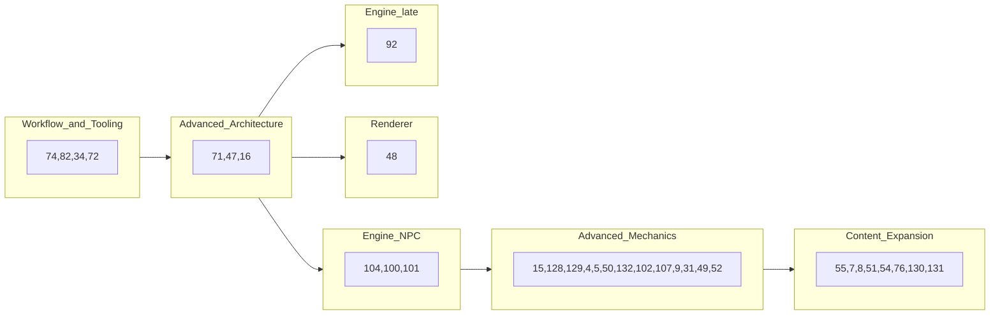

# DOSMUD ANSI C89 Development Plan

### Core Project Rules

The project should treat these as non-negotiable:

```text
Language target:
- ANSI C89 / ISO C90
- OpenWatcom compatible
- GCC compatible
- No compiler extensions required
```

The project should prioritize:

- deterministic gameplay
- procedural ANSI C architecture
- explicit ownership and state flow
- DOS/OpenWatcom portability
- maintainability over rapid expansion
- subsystem isolation
- deterministic testing

The project should avoid:

- framework-style architecture
- object-emulation patterns
- ECS-style abstractions
- hidden ownership
- platform/render leakage into gameplay
- premature complexity

When a draft PR is opened for an issue that **already has a section** here, mark that section **Done ✅** under its heading (optional PR link in the body). That line is not updated on later pushes or after merge - use the GitHub project board and PR for workflow status.

**Agents:** search for the issue (`#N` or section heading) before editing. If the issue has a GitHub **Milestone** and that milestone is **already represented** in this file, add an issue section under the matching milestone heading and mark **Done ✅**. Do not add sections for BAU issues without a Milestone, or for Milestones not tracked here. See [`AGENTS.md`](AGENTS.md) **DEV_PLAN updates**.

**Milestones:** [Structural Cleanup + ANSI C89 Enforcement](https://github.com/ianmays/dosmud/milestone/1) · [State Ownership and Boundary Isolation](https://github.com/ianmays/dosmud/milestone/2) · [Deterministic Test Harness Evolution](https://github.com/ianmays/dosmud/milestone/3) · [Workflow and Tooling Maturity](https://github.com/ianmays/dosmud/milestone/4) · [Advanced Architecture](https://github.com/ianmays/dosmud/milestone/5) · [Content Expansion](https://github.com/ianmays/dosmud/milestone/6) · [Renderer](https://github.com/ianmays/dosmud/milestone/7) · [Advanced Mechanics](https://github.com/ianmays/dosmud/milestone/8) · [Engine Enhancements](https://github.com/ianmays/dosmud/milestone/9)

### Execution order (open work)

Milestone numbers are **themes**, not strict schedule. Suggested pull order for open issues (see GitHub **blocked-by** relationships on each issue):



Workflow (milestone 4) can run in parallel with architecture once unblocked. Content (6) and renderer (7) are not gated on all of mechanics (8).

**Dependencies:** native GitHub **blocked-by** links on issues (Relationships sidebar). Key chains: [#71](https://github.com/ianmays/dosmud/issues/71) before [#47](https://github.com/ianmays/dosmud/issues/47) / [#104](https://github.com/ianmays/dosmud/issues/104) / [#48](https://github.com/ianmays/dosmud/issues/48); [#104](https://github.com/ianmays/dosmud/issues/104) before [#100](https://github.com/ianmays/dosmud/issues/100) / [#101](https://github.com/ianmays/dosmud/issues/101) / [#8](https://github.com/ianmays/dosmud/issues/8); [#101](https://github.com/ianmays/dosmud/issues/101) before [#102](https://github.com/ianmays/dosmud/issues/102) / [#107](https://github.com/ianmays/dosmud/issues/107); [#50](https://github.com/ianmays/dosmud/issues/50) before [#132](https://github.com/ianmays/dosmud/issues/132); [#92](https://github.com/ianmays/dosmud/issues/92) after [#16](https://github.com/ianmays/dosmud/issues/16), [#71](https://github.com/ianmays/dosmud/issues/71), [#47](https://github.com/ianmays/dosmud/issues/47).

### Current Project Priority

The project is currently in an architectural consolidation phase.

Highest-value work:

1. clarify subsystem ownership
2. reduce architecture drift
3. improve deterministic testing
4. preserve ANSI C89 portability
5. improve workflow/tooling discipline

Large-scale gameplay/content expansion should remain secondary until the core architecture stabilizes.

### Hard Constraints

#### Allowed
- fixed arrays
- static/global storage
- procedural architecture
- explicit state passing
- simple structs
- deterministic systems

#### Avoid
- dynamic allocation
- recursion
- compiler-specific features
- C99/C11 features
- hidden globals
- giant monolithic modules

## [Structural Cleanup + ANSI C89 Enforcement](https://github.com/ianmays/dosmud/milestone/1)

#### Primary Goals

- reduce complexity concentration
- preserve portability
- clarify subsystem ownership

### [#42](https://github.com/ianmays/dosmud/issues/42) - Split `game.c`

Done ✅.

Highest-priority architecture task.

Orchestration stays in `game.c`; combat, dialogue (pond + NPC hint), atmosphere (`gatmos`), wanderer, progression (`gprog`), and ambient encounter entry (`genc`) live in dedicated translation units (see `docs/architecture.md`).

Target structure:

```text
src/
    game.c
    combat.c
    dialogue.c
    gatmos.c
    wanderer.c
    gprog.c
    genc.c
```

#### `game.c`
Only:
- high-level orchestration
- tick sequencing
- command routing
- mode transitions

#### `combat.c`
Own:
- combat state
- combat flow
- enemy turns
- combat rewards

#### `dialogue.c`
Own:
- NPC dialogue
- reply handling
- dialogue state

#### `wanderer.c`
Own:
- wanderer movement
- encounter triggering
- separation logic

#### `gatmos.c` (atmosphere)
Own:
- ambient effects
- inspect clues
- environmental state

#### `gprog.c` (progression)
Own:
- XP
- leveling
- scaling

#### `genc.c` (encounter)
Own:
- random encounter spawning
- bandit logic
- encounter sequencing

Goal:
- reduce coupling
- simplify debugging
- improve maintainability
- prepare for renderer/platform separation

### ANSI C89 cleanup and compiler enforcement

#### Remove all K&R function definitions

✅ Done - no K&R definitions remain in `src/`.

#### Enforce strict C89 compilation

✅ Done - flags live in the `Makefile`.

GCC:

```text
-std=c89
-pedantic
-Wall
-Wextra
-Wshadow
-Wstrict-prototypes
-Wmissing-prototypes
```

Tests/CI only:

```text
-Werror
```

Compiler discipline and warning cleanliness should remain early priorities throughout development.

#### Ensure OpenWatcom parity

✅ Done - `make dos-prepare` covers the OpenWatcom path; ongoing discipline.

#### Remove mixed declarations/statements

✅ Done - enforced by `-pedantic`.

#### Replace C99 comments

✅ Done - no `//` comments remain in `src/`.

#### Centralize gameplay tuning values

✅ Done - gameplay tuning values live in `include/config.h`.

### [#41](https://github.com/ianmays/dosmud/issues/41) - Compatibility typedefs

✅ Done - [`include/base.h`](include/base.h) defines `u8`/`u16`/`u32` with documented width assumptions and compile-time `sizeof` guards; tick and byte-flag fields in `game.h` / `world.h` use these types.

## [State Ownership and Boundary Isolation](https://github.com/ianmays/dosmud/milestone/2)

### [#43](https://github.com/ianmays/dosmud/issues/43) - Replace overlapping flags with state structures

Done ✅.

[`src/game.h`](src/game.h) defines `GameMode` (`GAME_MODE_EXPLORE`, `GAME_MODE_DIALOGUE`, `GAME_MODE_COMBAT`), `DialogueKind` (room NPCs including frog, wanderer, enemy), and `CombatState` (`enemy_hp`, `defending`). `GameState` holds `mode`, `dialogue`, and `combat` instead of overlapping `pond_dialogue`, `wanderer_dialogue`, `enemy_dialogue`, `npc_dialogue`, and `combat_active` flags. Transitions go through `game_set_mode_explore`, `game_set_mode_dialogue`, and `game_set_mode_combat` in [`src/game.c`](src/game.c).

### [#44](https://github.com/ianmays/dosmud/issues/44) - Formalize engine boundaries

Done ✅.

- Documented core / render / platform layers in `docs/architecture.md`
- Moved all `invent.c` player output to `render_inv_*` in `grendr`
- Added `make check-layers` to reject `printf` outside `main.c`, `grendr.c`, and the platform file (`platpos.c` / `platdos.c`) (run explicitly or via `make test-all`; not part of `make test`)

### [#45](https://github.com/ianmays/dosmud/issues/45) - Platform layer

Done ✅.

- [`include/platform.h`](include/platform.h) - `plat_poll_line`, `plat_time_now`, `plat_seed_rng`
- [`src/platdos.c`](src/platdos.c) / [`src/platpos.c`](src/platpos.c) - DOS vs POSIX implementations (FAT 8.3 names; flat `src/` layout)
- [`src/main.c`](src/main.c) - no `#ifdef __WATCOMC__`; orchestration only

## [Deterministic Test Harness Evolution](https://github.com/ianmays/dosmud/milestone/3)

#### Existing snapshot testing

Pattern (under `tests/regression/`):

```text
<name>.input
<name>.expect
```

Run:

```text
make test && make test-run
```

Or manually: `./dosmud < tests/regression/<name>.input > tests/regression/<name>.output` then `diff` against `.expect`.

### [#66](https://github.com/ianmays/dosmud/issues/66) / [#112](https://github.com/ianmays/dosmud/issues/112) - Improve deterministic test setup

Done ✅.

`TEST_MODE` builds link [`tests/harness/testharn.c`](tests/harness/testharn.c) and [`tests/harness/th_world.c`](tests/harness/th_world.c). Snapshot `.input` files use `@fixture <name>` for known state without RNG-walking setup. Canonical fixture and test lists: [`docs/testing.md`](docs/testing.md). [#66](https://github.com/ianmays/dosmud/issues/66) added the harness; [#112](https://github.com/ianmays/dosmud/issues/112) migrated brittle snapshots to fixtures and roll inject for `equipment`.

Follow-up (under [#40](https://github.com/ianmays/dosmud/issues/40) umbrella):

- **[#66](https://github.com/ianmays/dosmud/issues/66)** Done ✅ - `TEST_MODE` harness and fixture DSL (see combined section with [#112](https://github.com/ianmays/dosmud/issues/112) above)
- **[#112](https://github.com/ianmays/dosmud/issues/112)** Done ✅ - migrated `equipment`, `area_items`, `craft_wielded`, `map`, `smoke` to fixtures; `seed_cli` still uses CLI `--seed` on `smoke.input`.
- **[#115](https://github.com/ianmays/dosmud/issues/115)** Done ✅ - snapshot coverage (PR [#123](https://github.com/ianmays/dosmud/pull/123)); details in the section below.
- **[#122](https://github.com/ianmays/dosmud/issues/122)** Done ✅ - optional `@seed <unsigned>` line in snapshot `.input` files (PR [#124](https://github.com/ianmays/dosmud/pull/124)).
- **[#95](https://github.com/ianmays/dosmud/issues/95)** Done ✅ - unit tests (PR [#127](https://github.com/ianmays/dosmud/pull/127)); **~96%** weighted branch coverage on core modules
- **[#116](https://github.com/ianmays/dosmud/issues/116)** Done ✅ - soak / stress harness (`make test-soak`, CI benchmarks)
- **[#113](https://github.com/ianmays/dosmud/issues/113)** Done ✅ - wanderer snapshot fixtures (`wanderer_dialogue` fixture; `wanderer_replies`, `wanderer_talk_blocked` snapshots)
- **[#114](https://github.com/ianmays/dosmud/issues/114)** Done ✅ - custom world boot fixture (`world_boot` / `world_linear`; `world_apply_graph` + harness tables in TEST_MODE)

### [#40](https://github.com/ianmays/dosmud/issues/40) - Gameplay test coverage (umbrella epic) — Done ✅

**[#40](https://github.com/ianmays/dosmud/issues/40)** tracked overall coverage; work landed via child issues (no mega-PR on [#40](https://github.com/ianmays/dosmud/issues/40)). **Epic complete** as of merge of [#116](https://github.com/ianmays/dosmud/issues/116) (PR [#133](https://github.com/ianmays/dosmud/pull/133)).

| Issue | Role |
|-------|------|
| [#40](https://github.com/ianmays/dosmud/issues/40) | Done ✅: umbrella epic (child issues below) |
| [#66](https://github.com/ianmays/dosmud/issues/66) | Done ✅: `TEST_MODE` harness + fixture DSL |
| [#46](https://github.com/ianmays/dosmud/issues/46) | Done ✅: runtime `--seed` CLI |
| [#112](https://github.com/ianmays/dosmud/issues/112) | Done ✅: migrate 5 brittle snapshots to fixtures |
| [#113](https://github.com/ianmays/dosmud/issues/113) | Done ✅: wanderer snapshot fixtures |
| [#114](https://github.com/ianmays/dosmud/issues/114) | Done ✅: custom world boot fixture |
| [#115](https://github.com/ianmays/dosmud/issues/115) | Done ✅: snapshot coverage + RNG hardening ([`docs/testing.md`](docs/testing.md)) |
| [#122](https://github.com/ianmays/dosmud/issues/122) | Done ✅: optional `@seed` harness directive for `.input` files |
| [#95](https://github.com/ianmays/dosmud/issues/95) | Done ✅: unit tests (PR [#127](https://github.com/ianmays/dosmud/pull/127)); **96%+** branch coverage on core modules |
| [#116](https://github.com/ianmays/dosmud/issues/116) | Done ✅: soak / stress (`make test-soak`, PR [#133](https://github.com/ianmays/dosmud/pull/133)) |

**Three layers (see [`docs/testing.md`](docs/testing.md)):** snapshots (`make test-run`), unit tests (`make test-unit`), soak/stress (`make test-soak`). `make test-all` runs check-layers, snapshots, unit coverage, and soak.

**Snapshot coverage ([#115](https://github.com/ianmays/dosmud/issues/115)) delivered:** 59 snapshots in `SNAPSHOT_TESTS` plus `seed_cli` (60 total in `make test-run`). Combat defend/salve/victory/loot/level-up, all room NPC talk branches, eat/use/inspect variants, `quiet_explore` for wait/move/map, bandit fight/intimidate/bag-empty, loot tiers, meta commands. RNG: `game_roll_percent` for intimidate; `test_quiet_ticks`; `CFG_TEST_*` inject constants.

**Harness layout (final):** fixture DSL and `@seed` in [`tests/harness/testharn.c`](tests/harness/testharn.c); seed-1234 world graph in [`tests/harness/th_world.c`](tests/harness/th_world.c) (shared by snapshots, unit, soak).

### [#115](https://github.com/ianmays/dosmud/issues/115) - Snapshot coverage (Done ✅)

Delivered in PR [#123](https://github.com/ianmays/dosmud/pull/123).

**Gameplay / harness**

- Bandit intimidate uses `game_roll_percent` (injectable in `TEST_MODE`).
- `GameState.test_quiet_ticks` + `quiet_explore` fixture: tick-advancing tests skip atmosphere, animal noise, bandit ambush, and wanderer movement.
- Extended [`tests/harness/testharn.c`](tests/harness/testharn.c): room fixtures, bag helpers, env focus, combat-ready/victory inject, intimidate/fight ready fixtures.

**Tests**

- `Makefile` `SNAPSHOT_TESTS` (includes `smoke`); `seed_cli` alone uses `--seed 1234` on `smoke.input`.
- New regression pairs under `tests/regression/` for movement, NPCs, combat, loot, eat/use, inspect, bandit dialogue paths, and edge cases.

**Docs**

- [`docs/testing.md`](docs/testing.md) - fixture tables, determinism model, snapshot file list, adding-a-snapshot checklist.
- [`docs/architecture.md`](docs/architecture.md) - harness and RNG split updated.

**Unit scope:** `command`, `invent`, `combat`, `game`, `genc`, `wanderer`, `dialogue`, `gatmos`, `world` (fixed graph), `gprog`, `items`, `fmt`, `testharn`. Out of scope: `grendr`, `txtres`, `main`, platform glue.

### [#95](https://github.com/ianmays/dosmud/issues/95) - Unit tests (Done ✅)

Delivered in PR [#127](https://github.com/ianmays/dosmud/pull/127).

**Framework**

- [greatest 1.5.0](https://github.com/silentbicycle/greatest/releases/tag/v1.5.0) vendored as [`tests/unit/greatest.h`](tests/unit/greatest.h) (upstream commit + dosmud quiet-output patch in a follow-up commit).
- `make test-unit`, verbose/coverage targets; 88 unit tests; CI via [`scripts/ci-test-report.sh`](scripts/ci-test-report.sh) with PR result comment.

**Coverage**

- Weighted **95.7%** branch / **82.7%** line on in-scope modules (`make test-unit-coverage`).
- `render_set_suppress` in `TEST_MODE` keeps default runs quiet; `--verbose-gameplay` restores render text.

**Layout / tooling**

- Snapshots under [`tests/regression/`](tests/regression/).
- `dos-prepare.ps1` copies only `src/`, `include/`, `build.bat`.
- Harness `bag_full_gate` fixture for `testharn_apply` `-2` paths.

**Docs**

- [`docs/testing.md`](docs/testing.md) - unit layout, coverage levels, CI PR comment, shared `th_world.c` graph.

### [#116](https://github.com/ianmays/dosmud/issues/116) - Soak / stress tests (Done ✅)

Delivered in PR [#133](https://github.com/ianmays/dosmud/pull/133).

**Harness**

- Separate binary `tests/soak/build/dosmud_soak` via `make test-soak` (not linked into `make test-unit`).
- Long fixed-seed loops with `soak_assert_game_state_ok`; combat uses `CFG_TEST_SOAK_COMBAT_CHECK_INTERVAL` (50) over 200 rounds.

**Benchmarks**

- `SOAK_BENCH` lines with `us_per_tick` and `limit=` from `CFG_TEST_SOAK_LIMIT_*` in `config.h`.
- [`scripts/ci-test-report.sh`](scripts/ci-test-report.sh) soak step + PR benchmark table (parsed from log).

**Related cleanup in PR [#133](https://github.com/ianmays/dosmud/pull/133)**

- `testharn` moved from `src/` to `tests/harness/`; `dos-prepare.ps1` copies `tests/harness` for DOS `TEST_MODE`.

### [#46](https://github.com/ianmays/dosmud/issues/46) - Runtime `--seed`

Done ✅.

```text
dosmud --seed 1234
```

## [Workflow and Tooling Maturity](https://github.com/ianmays/dosmud/milestone/4)

| Issue | Title |
|-------|-------|
| [#34](https://github.com/ianmays/dosmud/issues/34) | modern windows build |
| [#72](https://github.com/ianmays/dosmud/issues/72) | sub-agents |
| [#74](https://github.com/ianmays/dosmud/issues/74) | agent skills |
| [#82](https://github.com/ianmays/dosmud/issues/82) | compile performance |

### [#74](https://github.com/ianmays/dosmud/issues/74) - Agent skills

Capture:
- workflow knowledge
- repo conventions
- deterministic testing workflows
- DOS/OpenWatcom constraints
- architecture expectations

### [#34](https://github.com/ianmays/dosmud/issues/34) - Modern Windows build

### [#72](https://github.com/ianmays/dosmud/issues/72) - Sub-agents

### [#82](https://github.com/ianmays/dosmud/issues/82) - Compile performance

## [Advanced Architecture](https://github.com/ianmays/dosmud/milestone/5)

### [#71](https://github.com/ianmays/dosmud/issues/71) - Separate core game engine from game logic

Separate deterministic gameplay/simulation from rendering, platform, and front-end so the engine can support alternative interfaces or games. Blocks [#47](https://github.com/ianmays/dosmud/issues/47), [#104](https://github.com/ianmays/dosmud/issues/104), [#48](https://github.com/ianmays/dosmud/issues/48), and [#92](https://github.com/ianmays/dosmud/issues/92).

### [#47](https://github.com/ianmays/dosmud/issues/47) - Event queue architecture

Future direction:

```text
gameplay -> event queue -> renderer
```

Introduce:

```c
struct GameEvent
```

Example event types:

```text
EVENT_DAMAGE
EVENT_MOVE
EVENT_DIALOGUE
EVENT_ITEM
EVENT_NOISE
```

Potential benefits:
- replay systems
- logging
- renderer flexibility
- deterministic event capture
- improved testing
- save/load consistency

This is one of the most important architectural upgrades in the long-term roadmap.

### [#16](https://github.com/ianmays/dosmud/issues/16) - Save/load system

Create:

```text
save.c
save.h
```

The current fixed-array architecture is already well suited to serialization because the project favors:
- fixed arrays
- deterministic state
- explicit structs

Avoid:
- pointers
- heap ownership
- variable-sized runtime structures
- function pointers in persistent state

Initial binary serialization is acceptable.

## [Content Expansion](https://github.com/ianmays/dosmud/milestone/6)

Gameplay and world content after core architecture stabilizes. Related mechanics (economy, quests, schedules, reputation) live under [Advanced Mechanics](https://github.com/ianmays/dosmud/milestone/8).

| Issue | Title |
|-------|-------|
| [#7](https://github.com/ianmays/dosmud/issues/7) | interactive world events |
| [#8](https://github.com/ianmays/dosmud/issues/8) | complex dialogue |
| [#51](https://github.com/ianmays/dosmud/issues/51) | weather |
| [#54](https://github.com/ianmays/dosmud/issues/54) | procedural encounters |
| [#55](https://github.com/ianmays/dosmud/issues/55) | larger worlds |
| [#76](https://github.com/ianmays/dosmud/issues/76) | concrete narrative |
| [#130](https://github.com/ianmays/dosmud/issues/130) | night time |
| [#131](https://github.com/ianmays/dosmud/issues/131) | cooking skill |

### [#7](https://github.com/ianmays/dosmud/issues/7) - Interactive world events

### [#8](https://github.com/ianmays/dosmud/issues/8) - Complex dialogue

### [#51](https://github.com/ianmays/dosmud/issues/51) - Weather

### [#54](https://github.com/ianmays/dosmud/issues/54) - Procedural encounters

### [#55](https://github.com/ianmays/dosmud/issues/55) - Larger worlds

### [#76](https://github.com/ianmays/dosmud/issues/76) - Concrete narrative

### [#130](https://github.com/ianmays/dosmud/issues/130) - Night time

### [#131](https://github.com/ianmays/dosmud/issues/131) - Cooking skill

## [Renderer](https://github.com/ianmays/dosmud/milestone/7)

### [#48](https://github.com/ianmays/dosmud/issues/48) - SDL renderer

Target structure:

```text
core/
render_text/
render_sdl/
platform/
```

SDL should own ONLY:
- rendering
- audio
- input
- timing

NOT:
- gameplay
- simulation
- combat logic
- world state

## [Advanced Mechanics](https://github.com/ianmays/dosmud/milestone/8)

| Issue | Title |
|-------|-------|
| [#4](https://github.com/ianmays/dosmud/issues/4) | combat initiative |
| [#5](https://github.com/ianmays/dosmud/issues/5) | enemy difficulty (level) |
| [#9](https://github.com/ianmays/dosmud/issues/9) | reputation system |
| [#15](https://github.com/ianmays/dosmud/issues/15) | character stats and rolls |
| [#31](https://github.com/ianmays/dosmud/issues/31) | easy / hard mode |
| [#49](https://github.com/ianmays/dosmud/issues/49) | quests |
| [#50](https://github.com/ianmays/dosmud/issues/50) | economy |
| [#52](https://github.com/ianmays/dosmud/issues/52) | npc schedules |
| [#132](https://github.com/ianmays/dosmud/issues/132) | NPC trade |
| [#102](https://github.com/ianmays/dosmud/issues/102) | fixed location enemies (Bandits) |
| [#107](https://github.com/ianmays/dosmud/issues/107) | enemies (Bandits) spawn and wander, rather than spawn randomly at player site |
| [#128](https://github.com/ianmays/dosmud/issues/128) | pick up all items |
| [#129](https://github.com/ianmays/dosmud/issues/129) | interactive looting |

### [#4](https://github.com/ianmays/dosmud/issues/4) - Combat initiative

### [#5](https://github.com/ianmays/dosmud/issues/5) - Enemy difficulty (level)

### [#9](https://github.com/ianmays/dosmud/issues/9) - Reputation system

### [#15](https://github.com/ianmays/dosmud/issues/15) - Character stats and rolls

### [#31](https://github.com/ianmays/dosmud/issues/31) - Easy / hard mode

### [#49](https://github.com/ianmays/dosmud/issues/49) - Quests

### [#50](https://github.com/ianmays/dosmud/issues/50) - Economy

### [#132](https://github.com/ianmays/dosmud/issues/132) - NPC trade

### [#52](https://github.com/ianmays/dosmud/issues/52) - NPC schedules

### [#102](https://github.com/ianmays/dosmud/issues/102) - Fixed location enemies (Bandits)

### [#107](https://github.com/ianmays/dosmud/issues/107) - Enemies (Bandits) spawn and wander

### [#128](https://github.com/ianmays/dosmud/issues/128) - Pick up all items

### [#129](https://github.com/ianmays/dosmud/issues/129) - Interactive looting

## [Engine Enhancements](https://github.com/ianmays/dosmud/milestone/9)

| Issue | Title |
|-------|-------|
| [#92](https://github.com/ianmays/dosmud/issues/92) | multiplayer |
| [#100](https://github.com/ianmays/dosmud/issues/100) | wanderer behaviour is re-usable for any NPC (wandering NPC) |
| [#101](https://github.com/ianmays/dosmud/issues/101) | bandit behaviour is re-usable for any NPC (enemy NPC) |
| [#104](https://github.com/ianmays/dosmud/issues/104) | npc module |

### [#104](https://github.com/ianmays/dosmud/issues/104) - NPC module

### [#100](https://github.com/ianmays/dosmud/issues/100) - Wanderer behaviour reusable for any NPC

### [#101](https://github.com/ianmays/dosmud/issues/101) - Bandit behaviour reusable for any NPC

### [#92](https://github.com/ianmays/dosmud/issues/92) - Multiplayer

## Important Final Guidance

Preferred architecture style:
- procedural
- explicit
- deterministic
- modular
- era appropriate

Do NOT turn this into:
- ECS
- component-heavy abstractions
- macro metaprogramming
- object-emulation frameworks
- service locator architectures
- modern enterprise-style architecture

Simple ANSI C scales surprisingly far when module boundaries stay disciplined.
