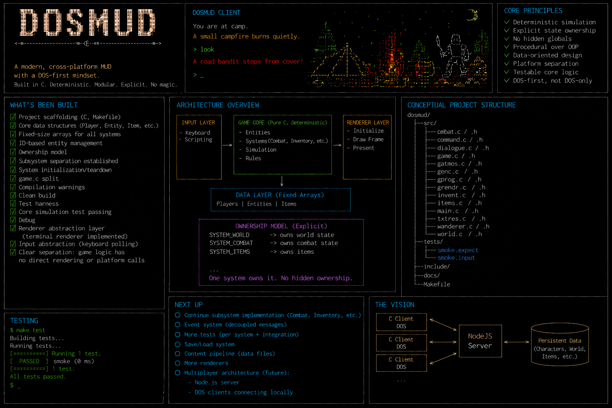

# dosmud

#### Disclaimer

This project is a personal learning and experimentation project provided "as is", without guarantees, warranties, or support of any kind.

While some care is taken to keep the codebase stable and documented, no guarantee is made regarding:
- correctness
- compatibility
- security
- fitness for any particular purpose

Use, modify, and distribute the project at your own risk.

The project is actively evolving and may change significantly over time.

## Introduction

A DOS-first MUD-like prototype in ANSI C.

The [dosmud GitHub Project](https://github.com/users/ianmays/projects/1) tracks sequencing and active work (Status and **blocked-by** relationships on issues). [GitHub milestones](https://github.com/ianmays/dosmud/milestones) group roadmap themes; they are not a strict schedule. The [DEV_PLAN](DEV_PLAN.md) outlines the development roadmap, execution order for open work, and architectural priorities.

[CONTRIBUTING.md](CONTRIBUTING.md) points to contributor workflow guidance.  
[AGENTS.md](AGENTS.md) contains repository guidance for coding agents.

Long-form project documentation lives in `/docs`:

- [Manual Index](docs/index.md)
- [Architecture](docs/architecture.md)
- [Testing](docs/testing.md)
- [Contributing](docs/contributor-guide.md)

The manual is deployed as [Github Pages](https://ianmays.github.io/dosmud/).

## At a glance
\* this is an AI-generated image - purely intended to give a sense of what this project is all about before you move on, do **not** consider this a source of truth as it may contain hallucinations 



## Quick start

Native development build:

```sh
make build
./dosmud
./dosmud --seed 1234
```

Native layers/strict/test checks:

```sh
make check-layers
make test
make test-run
make test-unit
make test-soak
```

Full validation (snapshots, unit coverage, soak): `make test-all`.

Details: [Testing](docs/testing.md) — snapshots in `tests/regression/`, fixture harness in `tests/harness/`, unit tests in `tests/unit/`, soak/stress in `tests/soak/`.

DOS/Open Watcom path:

```sh
make dos-prepare
make dos-run
```

See the [Makefile](Makefile) for all commands.
